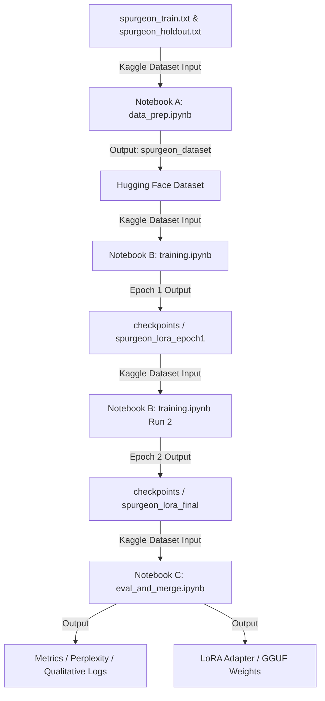

# Phase 1: Spurgeon Continued Pretraining — Step 3: Kaggle Notebook Structure

This file documents the structure, code cells, configuration, and session execution strategy for **Step 3: Kaggle Notebook Structure** of the continued pretraining phase.

Due to Kaggle Free Tier constraints (16GB GPU memory on a single T4 accelerator, 9-hour runtime limits per session, and 30 hours weekly quota), training is divided across three specialized notebooks. This isolates concerns, optimizes resource utilization, and prevents loss of training progress.

---

## 1. Overview of the Three-Notebook Workflow

The workflow utilizes three distinct notebooks to process the data, train the model, and verify the outputs:



---

## 2. Notebook A: Data Preparation (`data_prep.ipynb`)

* **Purpose:** Convert the cleaned, concatenated sermon text files into Hugging Face `Dataset` formats, perform a train/validation split, and save the binary dataset files.
* **Accelerator:** CPU (No GPU needed, conserving GPU hours).
* **Execution Time:** ~2-3 minutes.

### Cell 1: Environment Setup
```python
# Install lightweight Hugging Face datasets library
!pip install datasets -q
```

### Cell 2: Dataset Loading and Splitting
```python
from datasets import Dataset

# 1. Load the cleaned training text (produced in Step 2)
print("Loading training corpus...")
with open("/kaggle/input/spurgeon-cpt-corpus/spurgeon_train.txt", "r", encoding="utf-8") as f:
    train_text = f.read()

# Split into documents using the <|endoftext|> delimiter
train_docs = [d.strip() for d in train_text.split('<|endoftext|>') if len(d.strip()) > 200]
print(f"Loaded {len(train_docs)} training documents.")

# Create the training Hugging Face dataset
train_dataset = Dataset.from_dict({"text": train_docs})

# Split into a 99% train and 1% validation set for training-loss validation
dataset_split = train_dataset.train_test_split(test_size=0.01, seed=42)

# 2. Load the cleaned holdout text for final perplexity evaluations
print("Loading holdout corpus...")
with open("/kaggle/input/spurgeon-cpt-holdout/spurgeon_holdout.txt", "r", encoding="utf-8") as f:
    holdout_text = f.read()

holdout_docs = [d.strip() for d in holdout_text.split('<|endoftext|>') if len(d.strip()) > 200]
print(f"Loaded {len(holdout_docs)} holdout documents.")

holdout_dataset = Dataset.from_dict({"text": holdout_docs})

# Save datasets to Kaggle writable working directory
dataset_split.save_to_disk("/kaggle/working/spurgeon_dataset")
holdout_dataset.save_to_disk("/kaggle/working/spurgeon_holdout_dataset")

print("Train:", dataset_split["train"])
print("Val:", dataset_split["test"])
print("Holdout:", holdout_dataset)
```

### Outputs Generated:
* `/kaggle/working/spurgeon_dataset/` (Contains train and test subsets)
* `/kaggle/working/spurgeon_holdout_dataset/` (Contains holdout set)

*Action:* Once Notebook A completes, "Save Version" (Quick Save or Save & Run All) to make the outputs available as an Input Dataset named **`spurgeon-cpt-dataset`**.

---

## 3. Notebook B: Model Training (`training.ipynb`)

* **Purpose:** Execute PEFT QLoRA continued pretraining on `unsloth/Qwen2.5-3B` using the Hugging Face Dataset from Notebook A.
* **Accelerator:** 1x T4 GPU (Must turn **Internet ON** in settings to download Unsloth and base weights).
* **Execution Time:** ~7-9 hours per epoch. We will run 1 epoch per Kaggle session.

### Cell 1: Install Dependencies
```python
# Install Unsloth and specific patched versions for Kaggle environment
!pip install "unsloth[kaggle-new] @ git+https://github.com/unslothai/unsloth.git"
```

> [!WARNING]
> Do NOT upgrade `trl` or `transformers` manually after this step, as doing so will overwrite the CUDA-optimized kernels provided by Unsloth.

### Cell 2: Model and PEFT Setup
```python
from unsloth import FastLanguageModel
import torch

MAX_SEQ_LENGTH = 2048
LORA_RANK = 32

model, tokenizer = FastLanguageModel.from_pretrained(
    model_name   = "unsloth/Qwen2.5-3B",
    max_seq_length = MAX_SEQ_LENGTH,
    dtype        = None,
    load_in_4bit = True,
)

model = FastLanguageModel.get_peft_model(
    model,
    r = LORA_RANK,
    target_modules = [
        "q_proj", "k_proj", "v_proj", "o_proj",
        "gate_proj", "up_proj", "down_proj",
    ],
    lora_alpha   = 64,
    lora_dropout = 0, # Critical: set to 0 to enable fast custom Triton kernels
    bias         = "none",
    use_gradient_checkpointing = "unsloth",
    random_state = 42,
)
```

### Cell 3: Configure Training Arguments and Resumption Logic
```python
from trl import SFTTrainer, SFTConfig
from datasets import load_from_disk
import os

# Load the dataset generated in Notebook A
dataset = load_from_disk("/kaggle/input/spurgeon-cpt-dataset/spurgeon_dataset")

# RESUMPTION LOGIC CONFIGURATION
# To resume, mount the previous training run's output as an Input Dataset
RUN_NUMBER = 1 # Update to 2, 3, etc. for subsequent runs
RESUME_CHECKPOINT = None # e.g., "/kaggle/input/spurgeon-training-run-1/checkpoints/checkpoint-1500"

# Set total target epochs based on the run number
# CRITICAL: SFTTrainer will exit immediately if num_train_epochs <= completed_epochs in checkpoint
TOTAL_TARGET_EPOCHS = RUN_NUMBER 

training_args = SFTConfig(
    per_device_train_batch_size = 2,
    gradient_accumulation_steps = 8,   # Effective batch size = 16 (2 * 8)
    num_train_epochs            = TOTAL_TARGET_EPOCHS,
    warmup_steps                = 100,
    learning_rate               = 2e-4,
    lr_scheduler_type           = "cosine",
    fp16                        = not torch.cuda.is_bf16_supported(),
    bf16                        = torch.cuda.is_bf16_supported(),
    optim                       = "adamw_8bit",
    weight_decay                = 0.01,
    logging_steps               = 50,
    eval_strategy               = "steps",
    eval_steps                  = 500,
    save_strategy               = "steps",
    save_steps                  = 500,   # Save checkpoint every ~4.5 hours of training
    save_total_limit            = 3,     # Keep the last 3 checkpoints to manage disk space
    output_dir                  = "/kaggle/working/checkpoints",
    seed                        = 42,
    dataset_text_field          = "text",
    max_seq_length              = MAX_SEQ_LENGTH,
    packing                     = True,  # Packs multiple short texts into a single context window
)

trainer = SFTTrainer(
    model              = model,
    tokenizer          = tokenizer,
    train_dataset      = dataset["train"],
    eval_dataset       = dataset["test"],
    args               = training_args,
)
```

### Cell 4: Launch Training
```python
# Fix potential PicklingError with SFTConfig in Unsloth/TRL on Kaggle
import sys
import trl
if hasattr(trainer, "args") and trainer.args.__class__.__name__ == "SFTConfig":
    import trl.trainer.sft_config
    trl.trainer.sft_config.SFTConfig = trainer.args.__class__
    sys.modules["trl.trainer.sft_config"].SFTConfig = trainer.args.__class__
    trl.SFTConfig = trainer.args.__class__

if RESUME_CHECKPOINT and os.path.exists(RESUME_CHECKPOINT):
    print(f"Resuming training from checkpoint: {RESUME_CHECKPOINT}")
    trainer.train(resume_from_checkpoint=RESUME_CHECKPOINT)
else:
    print("Starting training from scratch...")
    trainer.train()
```

### Cell 5: Save Adapter Weights
```python
# Always save the adapter weights explicitly at the end of the session
output_path = f"/kaggle/working/spurgeon_lora_epoch{RUN_NUMBER}"
model.save_pretrained(output_path)
tokenizer.save_pretrained(output_path)
print(f"Saved adapter weights to {output_path}")
```

### Outputs Generated:
* `/kaggle/working/checkpoints/checkpoint-XXXX/` (Hugging Face trainer checkpoints)
* `/kaggle/working/spurgeon_lora_epochN/` (LoRA-only weights, ~100-300MB)

---

## 4. Notebook C: Evaluation, Merge, & Export (`eval_and_merge.ipynb`)

* **Purpose:** Calculate holdout dataset perplexity, perform qualitative tests on Spurgeon's preaching register, and output the merged weights or quantized formats.
* **Accelerator:** 1x T4 GPU.
* **Execution Time:** ~30-45 minutes.

### Cell 1: Install Dependencies
```python
!pip install "unsloth[kaggle-new] @ git+https://github.com/unslothai/unsloth.git"
```

### Cell 2: Load Model and LoRA Adapter
```python
from unsloth import FastLanguageModel
import torch

MAX_SEQ_LENGTH = 2048

# Update this path to the Kaggle Input directory containing the final training run outputs
FINAL_LORA_PATH = "/kaggle/input/spurgeon-training-run-final/spurgeon_lora_final"

# 1. Load base Qwen model
model, tokenizer = FastLanguageModel.from_pretrained(
    model_name   = "unsloth/Qwen2.5-3B",
    max_seq_length = MAX_SEQ_LENGTH,
    dtype        = None,
    load_in_4bit = True,
)

# 2. Apply the fine-tuned PEFT LoRA adapter
model = FastLanguageModel.get_peft_model(
    model,
    r = 32,
    target_modules = ["q_proj", "k_proj", "v_proj", "o_proj", "gate_proj", "up_proj", "down_proj"],
    lora_alpha   = 64,
    lora_dropout = 0,
    bias         = "none",
    use_gradient_checkpointing = "unsloth",
    random_state = 42,
)

# Load weights from the trained adapter
model.load_state_dict(torch.load(f"{FINAL_LORA_PATH}/adapter_model.bin"))
print("Model loaded with fine-tuned PEFT adapter.")
```

### Cell 3: Perplexity Evaluation on Holdout Set
```python
import math
from datasets import load_from_disk

# Set model to inference mode
FastLanguageModel.for_inference(model)

# Load holdout dataset built in Notebook A
holdout_dataset = load_from_disk("/kaggle/input/spurgeon-cpt-dataset/spurgeon_holdout_dataset")

total_loss = 0.0
total_tokens = 0

print("Evaluating perplexity over holdout documents...")
for idx, doc in enumerate(holdout_dataset):
    inputs = tokenizer(doc["text"], return_tensors="pt", truncation=True, max_length=MAX_SEQ_LENGTH)
    inputs = {k: v.to("cuda") for k, v in inputs.items()}
    
    with torch.no_grad():
        outputs = model(**inputs, labels=inputs["input_ids"])
        
    num_tokens = inputs["input_ids"].size(1)
    # Accumulate loss weighted by token count
    total_loss += outputs.loss.item() * num_tokens
    total_tokens += num_tokens

average_loss = total_loss / total_tokens
perplexity = math.exp(average_loss)

print(f"\nAverage Cross-Entropy Loss: {average_loss:.4f}")
print(f"Final Holdout Perplexity: {perplexity:.2f}")
```

### Cell 4: Qualitative Style Validation
```python
prompts = [
    # Completion Test
    "The love of Christ is not a cold, speculative thing. It is ",
    # Sermon Opening Test
    "Text: Romans 8:28. 'And we know that all things work together for good to them that love God.' My dear friends, ",
    # Outline & Doctrine Test
    "What, then, is saving faith? Let us examine this question carefully, for "
]

print("Running qualitative generations...\n")
for i, prompt in enumerate(prompts):
    print(f"--- Prompt {i+1} ---")
    print(f"Input: {prompt}")
    
    inputs = tokenizer(prompt, return_tensors="pt").to("cuda")
    
    with torch.no_grad():
        outputs = model.generate(
            **inputs, 
            max_new_tokens=150, 
            temperature=0.7, 
            top_p=0.9, 
            do_sample=True,
            pad_token_id=tokenizer.eos_token_id
        )
        
    generated_text = tokenizer.decode(outputs[0], skip_special_tokens=True)
    print(f"Output:\n{generated_text}\n")
```

### Cell 5: Merge and Save Export Options
```python
# Recommend Option B (Save LoRA adapter only) for Phase 2 integration
print("Saving LoRA adapter only...")
model.save_pretrained("/kaggle/working/spurgeon_lora_final")
tokenizer.save_pretrained("/kaggle/working/spurgeon_lora_final")

# Optional: Save merged 16bit model (requires standard RAM/Disk limits)
# model.save_pretrained_merged("/kaggle/working/spurgeon_merged", tokenizer, save_method="merged_16bit")
```

---

## 5. Session and Resumption Run Sheets

To train over a corpus of ~30.28M tokens (which takes roughly 16 hours total for 2 full epochs), follow this checklist:

### Session 1: Dataset Generation & Run 1
1. **Run `data_prep.ipynb`** on CPU to produce `spurgeon-cpt-dataset`. Keep Internet ON. "Save Version" as `spurgeon-cpt-dataset`.
2. **Launch `training.ipynb` (Run 1):**
   - Add `spurgeon-cpt-dataset` as input.
   - Set `RUN_NUMBER = 1` and `RESUME_CHECKPOINT = None`.
   - Set `num_train_epochs = 1` in `TrainingArguments`.
   - Ensure GPU is selected (T4) and Internet is ON.
   - Run the notebook. At completion, it outputs `/kaggle/working/checkpoints` and `/kaggle/working/spurgeon_lora_epoch1`.
   - "Save Version" (Save & Run All) to persist outputs. Call the output **`spurgeon-training-run-1`**.

### Session 2: Run 2 (Epoch 2 / Final Epoch)
1. **Launch `training.ipynb` (Run 2):**
   - Add `spurgeon-cpt-dataset` as input.
   - Add the output dataset `spurgeon-training-run-1` as input.
   - Set `RUN_NUMBER = 2`.
   - Find the last saved checkpoint step in `spurgeon-training-run-1` (e.g. `checkpoint-1500`).
   - Set `RESUME_CHECKPOINT = "/kaggle/input/spurgeon-training-run-1/checkpoints/checkpoint-1500"`.
   - Set `num_train_epochs = 2` (incremented by 1).
   - Run the notebook. The trainer will automatically resume from step 1500 and train until Epoch 2 is complete.
   - Save output as **`spurgeon-training-run-2`** (which will contain `/kaggle/working/spurgeon_lora_epoch2` and the final adapter weights).

### Session 3: Evaluation and Export
1. **Run `eval_and_merge.ipynb`:**
   - Add `spurgeon-cpt-dataset` as input.
   - Add `spurgeon-training-run-2` as input.
   - Set `FINAL_LORA_PATH = "/kaggle/input/spurgeon-training-run-2/spurgeon_lora_epoch2"`.
   - Execute the notebook to compute final holdout perplexity, qualitative comparisons, and save the final adapter under `/kaggle/working/spurgeon_lora_final`.

---

## 6. Key Risks and Mitigations during Step 3

| Risk | Mitigation |
| :--- | :--- |
| **Kaggle Kernel OOM** | Keep `per_device_train_batch_size = 2` and context `MAX_SEQ_LENGTH = 2048`. If VRAM grows, verify `lora_dropout = 0` (non-zero disables memory-efficient Triton kernels). |
| **Immediate Exit Bug** | Always ensure that `num_train_epochs` matches or exceeds the target epoch number when resuming. If resuming Run 2, `num_train_epochs` MUST be set to `2`. |
| **Kaggle Output Limit** | Keep `save_total_limit = 3` to avoid exceeding the 20GB disk quota by keeping too many checkpoints. |
| **Loss of Intermediate Checkpoints** | Always use "Save Version" → "Save & Run All" to run notebooks in the background. If a browser disconnects, Kaggle will complete the run and persist all outputs up to the limit. |
